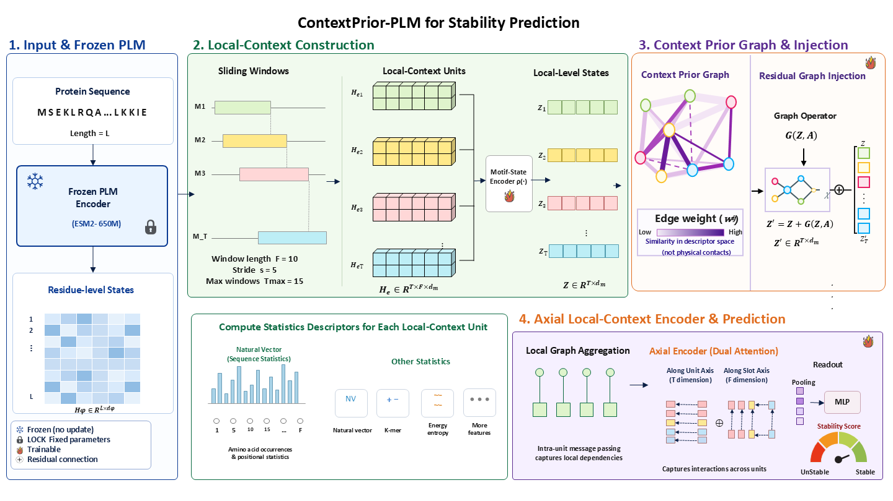

<div align="center">

# ContextPrior-PLM

### Sequence-statistical local-context graph adaptation of ESM-2 representations for protein stability prediction

[]()
[]()
[]()
[]()
[]()

**ContextPrior-PLM** is a frozen protein language model adapter for protein variant stability prediction.
It preserves ESM-2 residue states in overlapping local-context units and injects Natural Vector-guided graph information before sequence-level readout.

</div>

---

## Project overview

<p align="center">
  <a href="figs/overview.pdf">
    
  </a>
</p>

<p align="center">
  <b>Click the figure to open the full project overview PDF.</b>
</p>

---

## What is included?

This repository is a compact public code release for training **ContextPrior-PLM** on protein stability prediction and selected BioMap tasks.

It includes:

* ContextPrior-PLM model implementation;
* dataset loaders for SaProtHub stability and  BioMap tasks;
* training and evaluation scripts;
* configuration files for the main experiments;

 
---

## Why ContextPrior-PLM?

Protein engineering often requires selecting a small number of candidate variants for costly experimental validation. A useful stability predictor should therefore support both accurate stability-score regression and stable-variant prioritization.

Many frozen PLM-based predictors compress residue-level representations into sequence-level summaries before prediction. This early aggregation can weaken local sequence-context signals that are relevant to protein stability.

ContextPrior-PLM introduces an intermediate local-context representation before sequence-level readout.

---

## Method at a glance

ContextPrior-PLM combines two components:

 
1. **Overlapping local-context units**
   Projected residue states are grouped into overlapping windows, preserving local PLM-derived context before global aggregation.

2. **Natural Vector-guided context prior graph**
   Local contexts are connected using alignment-free sequence-statistical similarity derived from Natural Vector descriptors. The graph does not rely on structural coordinates or annotated motifs.

The graph-derived information is injected into the local-context field before sequence-level prediction.

---

## Main results

On the SaProtHub protein stability benchmark, ContextPrior-PLM with frozen ESM-2 650M achieved:

| Model                         |   Spearman |       RMSE | Precision@1000 |
| ----------------------------- | ---------: | ---------: | -------------: |
| Strongest frozen-PLM baseline |     0.8427 |     0.5992 |          0.519 |
| **ContextPrior-PLM**          | **0.9255** | **0.4181** |      **0.728** |

Compared with the strongest frozen-PLM baseline, ContextPrior-PLM improved Spearman correlation by **0.0828**, reduced RMSE by **30.2%**, and improved stable-variant prioritization from **0.519** to **0.728** in Precision@1000.

---

## Installation

Clone the repository:

```bash
git clone https://github.com/karlieswift/ContextPrior-PLM.git ContextPriorPLM
cd ContextPriorPLM
```


---

## Data preparation

### SaProtHub stability

For SaProtHub stability, either place a local Hugging Face cache at:

```text
data/stability/saprothub_meta_stability
```

 

### BioMap tasks

BioMap tasks are loaded through the dataset loader (either place a local Hugging Face cache):

```text
src/contextPrior/data/biomap.py
```
For SaProtHub stability and biomap, either download the prepared data bundle from Zenodo:

```text
https://sandbox.zenodo.org/records/514784
```
---

## Run the main stability experiment

The public default uses frozen ESM-2 650M with the ContextPrior local-context and Natural Vector-guided graph adapter.

 

Equivalent direct Python command:

```bash
python scripts/run_stability_finetune.py \
  --config configs/base.yaml \
  --config configs/stability_experiments/stability_main.yaml \
  --config configs/data/saprothub_meta_stability_official_csv.yaml \
  --config configs/methods/ours.yaml \
  --config configs/backbones/esm2_650m.yaml \
  --config configs/scales/xlarge_650m.yaml \
  --config configs/contextprior/default_graph.yaml \
  --config configs/contextprior/stability_dense_f10_s5_t15.yaml \
  --config configs/train_modes/frozen.yaml \
  --config configs/runtime/seed42.yaml
```
 
---

## Run selected BioMap tasks

 

Equivalent direct Python command:

```bash
python scripts/run_finetune.py \
  --config configs/base.yaml \
  --config configs/experiments/biomap_selected_stable_variant.yaml \
  --config configs/methods/ours.yaml \
  --config configs/backbones/esm2_650m.yaml \
  --config configs/scales/xlarge_650m.yaml \
  --config configs/contextprior/default_graph.yaml \
  --config configs/train_modes/frozen.yaml \
  --config configs/runtime/seed42.yaml
```

 
 
---

 
 

 

## Data and code availability

Data and code used in this study are available at:

```text
https://github.com/karlieswift/ContextPrior-PLM
```

An archived version of the repository and accompanying data is available from Zenodo:

```text
https://sandbox.zenodo.org/records/514784
```

For the final publication version, the sandbox Zenodo record should be replaced by a formal Zenodo DOI.

---

## Citation

If you use ContextPrior-PLM in your research, please cite:

```bibtex
@article{wang2026contextpriorplm,
  title   = {Natural Vector-guided local-context adaptation of frozen ESM-2 representations for protein stability prediction},
  author  = {Wang, Hao and Hu, Guoqing and Zhao, Xin and Yau, Stephen S.-T.},
  journal = {xxx},
  year    = {2026}
}
```


---

<div align="center">

**ContextPrior-PLM: preserving local PLM-derived context for stability prediction and stable-variant prioritization.**

</div>
